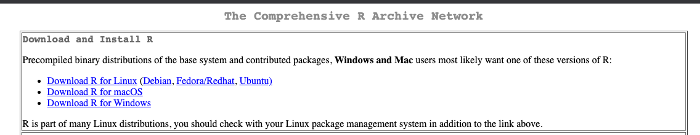
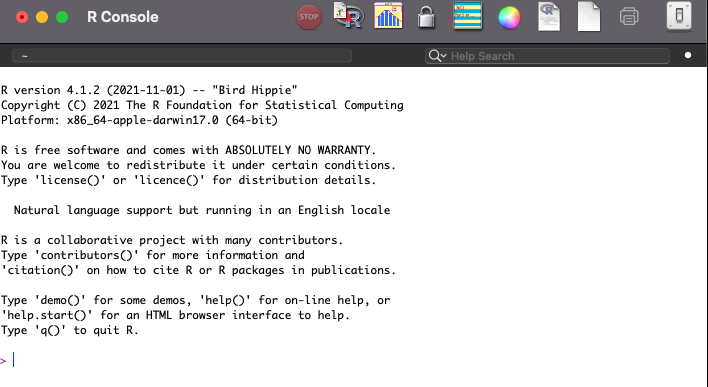
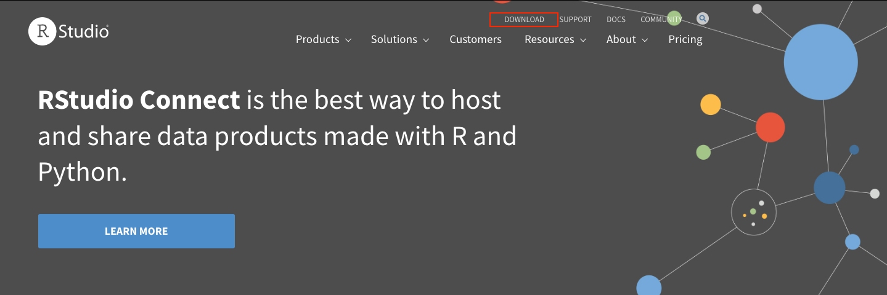

# R, RStudio, and how to get started

It is finally time to get started in R. To get started you first need to download and install R. You do this by going to the [Comprehensive R Archive Network (CRAN)](https://cran.r-project.org/) website, https://cran.r-project.org/. At the top of the website there is a box where you see three links allowing you do download R for your operating system (Linux, macOS, or Windows). 

Follow the link for your operating system and download the latest version of R (at the time of writing R 4.2.1). 

If you are on Windows, you should get the 'base' version at the top of the download site. If you are on macOS and have a new M1 mac you should get the version with 'arm64' in its name. If you have an older Intel Mac you get the version without 'arm64' in its name. Once you've downloaded the R install file (.pkg on mac and .exe on windows) install R by opening this file and following the instructions. Congratulations, you are now able to use R!

## RStudio and other IDEs
You've now installed R and could therefore start using it. However, what you have installed is just an interpreter for the R language, nothing else. If you were to open up R as you just had installed you would get to the R console which looks like this.

You are able to run R code in the R console, but it is not very hospitable as it does not by itself keep track of everything we have inside our R session, the code we have run, and the scripts we want to run. We are therefore also going to install RStudio which will help us use R by providing us with a nicer interface with which to interact with R. RStudio is the most popular IDE (integrated developer environment), i.e. interface, for R, and provides a lot of neat functionality for R which will come in handy as we continue to explore R. RStudio is, however, not the only IDE for R, there are a variety of other IDEs which you could potentially use and do not feel locked into RStudio if you find one you like better. Everything we learn in this course is translatable across different IDEs for R. 

When thinking about R and RStudio, it is important to distinguish between the language R, the underlying interpreter of R, and the interface through which we interact with R. RStudio is not R, rather it is a tool that helps us communicate with R by providing additional features which are helpful in this endeavor. Thus, whenever we work in R, what we actually are doing is working *with* R through RStudio, and RStudio is the program we are going to have open as we continue to work through this book.

### Installing RStudio
To start working in RStudio we first need to download and install it. You do this by going to [RStudio's website](https://www.rstudio.com/), https://www.rstudio.com/. At the top of the website you can see the 'download' button which will take you to the download page. 

On the download you select the free RStudio Desktop version and click download. This will take you to a second page where you get to select your operating system (Linux, macOS, or Windows). Select the file for your operating system and download it.Once you've downloaded the RStudio install file (.dmg on mac and .exe on windows) install RStudio by opening this file and following the instructions. You are now ready to dive into using R with RStudio!.

