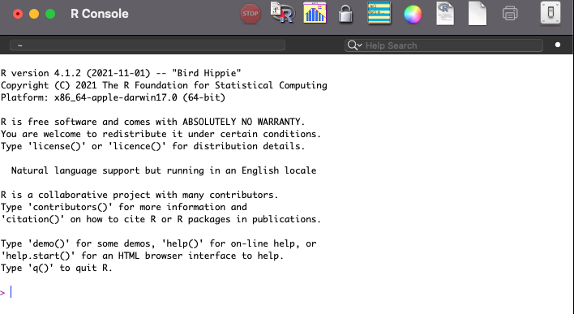

--- 
title: "The R Researcher's companion v. 0.01"
subtitle: "A gentle introduction to R with applications in war and peace"
author: "David Randahl"
date: "`r Sys.Date()`"
site: bookdown::bookdown_site
documentclass: book
bibliography: [book.bib, packages.bib]
# url: your book url like https://bookdown.org/yihui/bookdown
# cover-image: path to the social sharing image like images/cover.jpg
description: |
  This is an accompanying book for the R workshops for the Methods II and Methods II Advanced courses in the Master's programme in peace and conflict studies at Uppsala University.
link-citations: yes
#github-repo: rstudio/bookdown-demo
---

# Preface {-}
Welcome to this draft online edition of *The R Researcher's companion*. This is a project that has been in the works for a long time and is finally, hopefully, coming together. In this 'book' (really, it is just a collection lecture and workshop notes) my ambition is to convince you that R is not an obstacle to be overcome. Rather, I want to convince you that knowing R is a gateway to a fantastic new world of data analysis and exploration. I want to convince you that knowing R will open up new doors for you to understand your data, to understand your methods, and to answer research questions in ways you previously thought not possible. While learning R may seem (unnecessarily) complicated, I assure you that learning enough R to perform basic data analysis is within the grasp of anyone. 

## Why another book about R? {-}
This book is born out of half a decade of teaching R to undergraduate and graduate students in the social sciences. Teaching R in this context is always challenging as many of the students are neither interested in R itself, nor the underlying statistical theory which underpins modern data analysis and on-top of which R is built. Instead, these students are interested in the output of the data analysis, the plots, diagrams, and charts which describe the data, or the regression tables, correlations, and diagnostics from which inferences about the data can be drawn. The primary challenges for teaching R in this environment are to convince the students that R is not (much) more challenging to learn than alternatives such as SPSS or STATA (or, god forbid, Excel!) which allow them to obtain these outputs without having to rely on coding, and that learning R will actually help them better understand these outputs as they will gain a deeper understanding of the underlying data and the way that it is being processed. Compounding these challenges have been a lack of literature specifically tailored to this category of students, i.e. students with limited or no background in statistics or programming but who are keen on learning how to conduct research using R. The fundamental problem is that most books on research methodology and R fall in one of two camps, (1) books focusing on research methodology and/or data analysis with applications in R or another statistical software but without the fundamentals of R, or (2) books which are focused on data science and R from a programming perspective. Books in the first category are usually very useful for teaching the methodology and how to conduct the analysis itself, but without a strong foundation in R students may feel lost in the applications and may simply resort to copying and pasting code from the book without understanding how and why to edit this code to suit their own research questions. Books in the second category, on the other hand, are generally tailored to a different audience with a stronger interest in the *programming* side of R and who may have a more extensive background in data science and/or programming. 

The book you are currently reading aims to fill this gap in the teaching literature for R. This book is supposed to be used as a *researcher's companion*, i.e. a book which you can go back to at any point during your research process to look up how certain concepts work in R and how to figure out where you've gone wrong. It assumes neither any knowledge of R beforehand, not any extensive knowledge of mathematical or statistical methodology. My hope is that this short book will to allow you to go from zero knowledge in R to being comfortable reading and writing your own code, and that it will be a support for you when doing the data analysis in R for your research projects.

## What this book will teach you (and what it will not) {-}
As this book is supposed to be a researcher's companion rather than a book on research methodology, there are some strict limitations on what this book will teach you and what it will not. This book will be strictly focused on R, the central concepts you need to understand in order to do data analysis in R, the fundamental pre-processing needed to do data analysis properly, and how to best present your results. On the other hand, this book will *not* teach you research methodology. It will *not* provide you with any fundamental understanding of data analysis techniques beyond the mechanical understanding of how to run some simpler techniques, and it will *not* help you understand diagnostics for methods or when and why to use certain types of methods over other types of methods. Thus, this book is a *companion* intended to be read alongside books which dive deeper into the substantive topics on how to conduct research and best utilize statistical models but which do not help you figure out why you're getting a specific type of error when you're running your code, how to best transform, merge, or otherwise wrangle your data, or how to make stylish and beautiful plots and tables, and how to customize them. This book is not intended to be an exhaustive guide to R, but rather as a introduction to take you over the most common hurdles you will face when embarking on your journey to become proficient in R. Once you've reached the end of this book, you should feel comfortable moving on to more advanced books on programming in R such as Hadley Wickham's fantastic books [R for data science](https://r4ds.had.co.nz/) and [Advanced R](https://adv-r.hadley.nz/) or Måns Thulin's excellent applied book [Modern Statistics with R](https://modernstatisticswithr.com/).

## Outline of the book and how to read it {-}
This book is comprised of three main parts. In the first part, we will focus on the *basics* of R including an introduction to what R is, what the difference between R and RStudio (and other IDEs) are and how a basic workflow in RStudio can look. This part is the most mechanical of the book and will introduce a lot of programming concepts such as functions, objects, and packages which are crucial in order to understand how to work with R. It will also briefly touch upon different types of data and how generic methods differ depending on these data types.

The focus of the second part of the book is *data*. In this part, you will learn how to load different types of data into R, how to transform data by modifying or adding new variables to your data, and how to filter out and select parts of the data. It will also teach you how to combine data from different sources into a single data frame, how to aggregate data across different groups, and how to summarize your data. We will do all of this using the syntax (i.e. way of writing code) of the `tidyverse` package and we will build a toolbox of tools you'll be able to apply whenever you embark on a data analysis project.

In the final part of the book we will look at *data presentation*. Here you will learn how to run simple statistical models, how to make beautiful and customizable plots to visualize your data and your results using the `ggplot` package, and nice-looking well-formatted regression tables using the `stargazer` package. We will also briefly look at some alternatives for making tables using a combination of the `tidyverse` syntax in the `gtsummary` package.

Now without further ado, let's dive into the wonderful world of R!


<!--chapter:end:index.Rmd-->

# (PART) Workshop 1: Introduction and basics of R {-}
# What is R and why should you learn it?

## R, a programming language for data analysis
So, what is R really? Well, R is a programming language which was developed as a free open source successor to the *S* programming language and first saw the light of day in the early 1990s'. However, R is not like other programming languages which are often times built around being able to build general purpose applications for use in computer programs, apps, and websites. Instead, R is a *statistical* programming language, built by statisticians and data scientists specifically for the purpose of being a tool for data handling, data presentation, and data analysis. 

The fact that R is a programming language allows you to build your own tools or use tools others have built and made available in the over 17,000 unique packages for R in order to best analyze your data and provide answers to your research questions. This flexibility makes R a highly versatile and powerful tool for conducting your analysis compared to alternative data analysis *software* such as SPSS, STATA, SAS, and Excel, which locks the user into the tools available in those specific software. On top of that, R allows you to work directly with the data in a way that no competitor can, it allows you to deep dive into analyses of sub-samples and sub-groups, to merge, transform, and otherwise wrangle data in ways which in other software or programming languages are complicated at best, all while keeping the syntax and workflow neat and tidy. In essence, R is the best tool available for handling and analyzing data currently available.  

## Why learn R?
You might think to yourself: *I'm not interested in programming and I just want to be able to conduct some basic data analysis. Why should I learn R?* Great question! Apart from the obvious reason mentioned above, that R is the best tool available for handling and analyzing data, there are several other reasons one should learn R, and the fact that R is free, there are several good reasons why you should invest the time in learning R. First and foremost among these is that learning R will help you better understand the data you are working with and the methods you are trying to use to analyze this data. Being able to easily dive into the data by filtering, selecting, summarizing, and aggregating the raw data along the way brings you *closer* to the data and allows you to better understand the strengths and weaknesses of your data in a way which is neigh on impossible without a flexible tool like R. 

R also offers you better opportunities to learn about the methods you are using. If you get a weird or unexpected result when doing the analysis, R offers you the tools to figure out what is happening and whether the results are an effect of something going wrong in the analysis, or if there are quirks in the data which generate these odd results. By working in R you are also promoting the ideal of reproducible research. Since R is open source and free, sharing the R code for your analysis with colleagues or reviewers allows them to see what you have done and thereby easier replicate your results or build on the results when conducting their own research. 

The flexibility of R and the ability to work outside the box also tend to generate new types of research questions, as your mind is free to look for interesting phenomena outside the ones which are possible to analyze within a strict framework of already existing models. This is particularly true when you (at a later point in your journey into research methodology!) start to understand what the limits of the most common statistical methods are and you want to move past these to address new types of questions which may arise.

Finally, knowing R is a highly marketable skill, and you will never regret having learned the basics in R even if you end up in a job where this is not used. We are inexorably moving towards a more interconnected world which produces reams upon reams of data about both you and the world you live in, which will inevitably be used in different types of analysis. Having a basic understanding of how such analysis may be done is therefore fast becoming somewhat of a life skill and something which everyone ought to have.

## How to approach learning R
Now that you're convinced of the importance of learning R, how should you approach this topic? R is a programming *language* and learning R is therefore similar to learning a language. However, instead of concepts such as "adjectives", "verbs", and "nouns", you will have to learn concepts such as "objects", "functions", and "arguments". At times it will be frustrating, and at times you will just want to give up. Just remember that as with learning any language, practice is the key to succeeding. However, there are also some key differences in learning a *programming* language compared to a human language. 

Primary among these are that when you are communicating in a human language in which you are not fully fluent, the receiver of the communication is usually able to interpret what you're saying despite potential grammatical or other linguistic mistakes and you may therefore make yourself understood despite lacking some of the fundamental understanding of the language. In programming languages, on the other hand, the interpreter is completely unable to understand you if you make any errors in your syntax (akin to grammar in human languages) or if you have any spelling errors in your code. Thus, while it may be frustrating to start learning R by learning things like the equivalent of "Hi, my name is X" or the duolingo-style "The shark did not eat the helicopter" when all you want to do is dive into deeper conversations about the philosophy of science, it is absolutely essential to build a solid foundation of understanding the structure of the language before moving on to the more advanced topics. 

Another difference between human languages and R is that while R, as all programming languages, is completely inflexible when it comes to the syntax and spelling, it also very flexible and has very few opinions on what is the 'right' or 'wrong' way of doing things. Thus, as long as you use correct syntax there are usually a multitude of different ways of doing the same thing, of which neither is necessarily more right or wrong. This feature of R may sometimes be confusing, but it also allows you to use R in the way that is most intuitive to you. It also allows you to develop your specific way of writing R over time and constantly improve the way you write your code for your data analysis. 

As with any language, however, the only real way of learning it is by using it. In order to learn R properly you therefore need to find useful projects on which you can use the skills you learn here. Maybe you have some data associated with a course paper or working paper you want to dive deeper into and explore, or maybe you want to use the trial data sets provided with this book to investigate certain relationships. My recommendation would therefore be to find a project or find some data which you are interested in exploring, and keep it near at hand when you are reading this book. The code snippets that will be provided in this book can be seen as phrases from an old-school phrase-book. They are not useful if you only repeat them for yourself, they become useful when you apply them to your own data and adapt them to the specific situation you are in.


<!--
So, what is R really? Well, R is in essence a statistical programming language and software which we can use to do statistical analyses. It's a highly powerful and flexible program that can do all sorts of things, and which you can use to make your own programs and tools which you often use. Simply put, it's quite a lot like a statistics sandbox. It can be quite daunting to learn R, and the learning curve is sometimes quite steep, but something to remember is that google is always your friend. Since R is a program which requires you to write what you do, there are a thousand and one tutorials and help pages available online, so if you get stuck you can always try googeling your problem. As I mentioned, R is a language, and learning R is pretty similar to learning a language. However, instead of concepts such as "adjectives", "verbs", and "nouns", you will have to learn concepts such as "objects", "functions", and "arugments". At times it will be frustrating, and at times you will just want to give up. Just remember that as with learning any language, practice is the key to succeeding. It is also important to know taht R is a very flexible language, which means that there are usually a multitude of different ways of doing the same thing. This may sometimes be confusing, but it also allows you to use the methods that are most intuitive to you in order to get what you need done done. Today, we are going to go through some basics of R, how it works, and what some of the fundamental concepts are. In the first three hours of the workshop, we will cover the basics of R, and the basics of importing and manipulating data. The fourth hour will cover some slightly more advanced topics which are required for the Methods II Advanced course, but I would still encourage all of you to stay for that hour. 
-->


<!--chapter:end:01-intro.Rmd-->

# R, RStudio, and how to get started

It is finally time to get started in R. To get started you first need to download and install R. You do this by going to the [Comprehensive R Archive Network (CRAN)](https://cran.r-project.org/) website, https://cran.r-project.org/. At the top of the website there is a box where you see three links allowing you do download R for your operating system (Linux, macOS, or Windows). 


Follow the link for your operating system and download the latest version of R (at the time of writing R 4.2.1). 

If you are on Windows, you should get the 'base' version at the top of the download site. If you are on macOS and have a new M1 mac you should get the version with 'arm64' in its name. If you have an older Intel Mac you get the version without 'arm64' in its name. Once you've downloaded the R install file (.pkg on mac and .exe on windows) install R by opening this file and following the instructions. Congratulations, you are now able to use R!

## RStudio and other IDEs
You've now installed R and could therefore start using it. However, what you have installed is just an interpreter for the R language, nothing else. If you were to open up R as you just had installed you would get to the R console which looks like this.



You are able to run R code in the R console, but it is not very hospitable as it does not by itself keep track of everything we have inside our R session, the code we have run, and the scripts we want to run. We are therefore also going to install RStudio which will help us use R by providing us with a nicer interface with which to interact with R. RStudio is the most popular IDE (integrated developer environment), i.e. interface, for R, and provides a lot of neat functionality for R which will come in handy as we continue to explore R. RStudio is, however, not the only IDE for R, there are a variety of other IDEs which you could potentially use and do not feel locked into RStudio if you find one you like better. Everything we learn in this course is translatable across different IDEs for R. 

When thinking about R and RStudio, it is important to distinguish between the language R, the underlying interpreter of R, and the interface through which we interact with R. RStudio is not R, rather it is a tool that helps us communicate with R by providing additional features which are helpful in this endeavor. Thus, whenever we work in R, what we actually are doing is working *with* R through RStudio, and RStudio is the program we are going to have open as we continue to work through this book.

### Installing RStudio
To start working in RStudio we first need to download and install it. You do this by going to [RStudio's website](https://www.rstudio.com/), https://www.rstudio.com/. At the top of the website you can see the 'download' button which will take you to the download page. 


On the download you select the free RStudio Desktop version and click download. This will take you to a second page where you get to select your operating system (Linux, macOS, or Windows). Select the file for your operating system and download it.Once you've downloaded the RStudio install file (.dmg on mac and .exe on windows) install RStudio by opening this file and following the instructions. You are now ready to dive into using R with RStudio!.


<!--chapter:end:02-download-install.Rmd-->

# Basic workflow in R using RStudio
When you first open RStudio you will be greeted by a window with three different *panes* (i.e. sub-windows).


These three panes are
1. The *console* at the top left. This is where you can interactively run code. When you start R studio you will always see the R start-up message here which gives some basic information about which R version you are using and miscellaneous information about under what licence it may be used, and how to cite, etc. We will use the console in a bit to run our first lines of code.
2. At the top right, we have the *environment* pane. This is where you will see all of your objects, data, and functions (see next chapter) that you have available in your R session.
3. The *files, plots, and help* pane. In this pane you can view all of the files that are in your working directory, plots that you have made, what packages you have installed, and the help files for different functions. Don't worry if you do not know what a working directory, package, or help file is. We will cover this in due time. 

Each of the panes have different tabs which you can flip through to see other things such as the history, terminal, and other things. You can also customize the positions of the panes, as well as which tabs go in which pane in the preferences of RStudio.

Missing from these panes is, however, the most important pane, the *script* pane. We can open up the script pane by opening a new script. We do this by pressing the File menu at the top of RStudio and then *'New File > R Script'*. Doing this will open up an empty R script at the top left of the RStudio window, and will move the console pane to the lower left corner of the RStudio window. (Note: if you opened RStudio by opening an R script file you will already have this fourth window when RStudio starts)


It is here, in the *script* that we will do most of our work. A script is basically exactly what it sounds like. It is a script of instructions (code) that will be executed in the order that it is written. We will primarily work with scripts rather than directly in the console, as working in a script allows us to keep track of everything that we have done so far.

## Running code
Let us immediately deviate from the rule above and run some code in the console. In practice, everything that we do in R revolves around code. However, do not let that word *code* scare you. Coding is actually much more benign than it may first seem. For instance, we can use R as a calculator by entering `1+1` in the console and pressing enter. When you do this you should immediately see the console spitting out `[1] 2`. And just like that, you've run your first piece of code, 1+1=2! Thus, running code is simply giving R an instruction which it will execute and give an answer.

### Scripts
Now, we ran our first piece of code in the console, but as I said previously, most often we will primarily use the script. Running code from the script is slightly different than running it in the console, primarily because the code will not execute when you press enter. Instead you will just go to the next line of the script when you press enter. To execute code in a script you highlight the parts of the script you wish to run and either press Ctrl+Enter (Cmd+Enter on Macs) or the small bottom at the top of the script window called 'Run'. Let's try it by writing `2+2` on the first line in the script, highlighting it, and pressing Ctrl+Enter. When you do this you will see that the code is actually run in the console and you should see 
```
> 2+2 
[1] 4
```
in the console. This is because even when we write the code in the script, it is still executed in the console. However, as you can clearly see too, executing a piece of a script does not change the script. The scrip thus remains constant, and if you keep writing your code in the script you will have a perfect record of what you have done. A nice thing about scripts is that you can also run multiple lines of code by highlighting a larger section of code. For instance, if we were to add `2*4` to the second line of the script and `3+8*2` to the third line of the script so that our script looks like this

```
1+1
2*4
3+8*2
```
we can run all of these lines of code by highlighting all three lines and pressing Ctrl+Enter. This will execute the code one line at a time in the console, and your output should look like this:

```
> 1+1
[1] 2
> 2*4
[1] 8
> 3+8*2
[1] 19
```

The point of this exercise is of course not that we should use R as a calculator, but rather to illustrate that running code is not something advanced. It is just an instruction to R to do something.

### Commenting in a script
When writing a script, you may want to keep track of what you are doing on the individual lines and why you are doing it. You can do this by including comments in the R script, which you do with the `#` sign. In the case of using R as a calculator, this may of course seem silly, but once you start doing more advanced data processing, it may be super useful to know what each line of code does and why. This is especially true when you are re-visiting an old R script that you have not worked with in a long time and you are trying to figure out what you did and why. 

To include a comment, simply write `#` after any piece of code you wish to comment on. Anything that follows the `#` on that line will not be interpreted as code and will not be executed by R. For instance we may add the following comments to our code above:

```
1+1 # I want to add one and one
2*4 # This line multiplies two by four
3+8*2 # This line shows that you can do multiple operations in one line
```

When we execute this code, you can see that the comments are still displayed in the console, but the results are exactly as before:

```
> 1+1 # I want to add one and one
[1] 2
> 2*4 # This line multiplies two by four
[1] 8
> 3+8*2 # This line shows that you can do multiple operations in one line
[1] 19
```

### Keeping track of our work and saving scripts
The point of having a script is to keep track of what we have done thus far, and to be able to replicate the things that we have already done. Thus, whenever we have worked on a project we should take care to save our scripts. You can save your script by pressing Ctrl+s (cmd+S on a mac), or go to menu at the top and press *'File > Save'* to save your R script. Don't forget to save your script often. 


<!--chapter:end:03-outline.Rmd-->

# Objects, functions, and packages
Now that we have a basic understanding about what it means to run code and what scripts are, let us introduce the fundamental workhorses of R. Objects, functions, and packages.

## Objects
An object is simply something, anything, that we want R to store so that we can access it. It can be anything from a single value, to a collection of values, to a data set, a function, or even a list of other objects. The only limit for objects are basically that each object needs to have a unique name, which is used to call the object.  

To create an object we use the so called assignment operator, which is simply this arrow: `<-` where we put the name of the object that we want to create on the left hand side of the arrow, and the object itself on the right hand side of the arrow. The name of the object cannot start with a number and is not allowed to contain spaces, or a number of special signs such as `+, -, :, $` and others. A good convention to get around the fact that you are not allowed to use spaces in names is to use either snake_case, in which you separate words with underscores `_` and which is the convention I will follow in this book, CamelCase, in which you put a capital letter as the first letter in each word, or period.case, in which you put periods between words. Another good convention is to name your objects descriptively so that you remember what they refer to. Using what we know, we can now create our first object by running the following code. Remember that you should always keep track of what you are doing, so you should write the code in the script and then running it by highlighting it and pressing Ctrl+Enter.

```
my_first_object <- 32
```

If you look at the environment pane, you will now see that an object appeared in our environment, and that object is called 'my_first_object'. The name here is arbitrary, and we could have named it anything (as long as it does not contain spaces or begin with a number). We can now call our object by simply writing the object name and running the code:

```
> my_first_object
[1] 32
```
As you can see, R simply fetches the object and prints it out. As 'my_first_object' is a number, we can treat it as any other number and perform mathematical operation on it, such as running `my_first_object*2+4` which would yield:

```
> my_first_object*2+4
[1] 68
```

We can also define a second object, and assign a number to it. For instance 

```
another_object <- 21
```

and then we can call both objects to for instance add them together

```
> my_first_object + another_object
[1] 53
```

If we then want to replace either of the variables, we can simply overwrite them by creating a new object with the same name. For instance by running

```
another_object <- 15
```

Then when we add the objects together we will see that

```
> my_first_object + another_object
[1] 47
```

So, how is this useful in practice? Well, let's say that you are interested in the number of people who have voted for a certain party in an election, but you only have access to the total number of people who voted and the vote shares of each party. We could then for instance run

```
# Calculating the number of votes for a specific party

voting_pop <- 9321800 # The number of people who cast their votes
vote_share <- 0.52 # The vote share of the party of interest

number_of_votes <- voting_pop*vote_share # Number of votes cast for the party
```

If we then want to investigate the number of votes for another party, all we need to do is simply change the value for the object `vote_share` to the vote share of the other party we are interested in knowing the number of votes for. If we are doing many calculations using a single object, we can save a lot of time by structuring our calculations in a script like above.

Another alternative if we want to investigate how many people voted for a number of different parties is to create a *vector* of values containing the vote shares of each party we are interested in. A vector is simply a collection of values, and are created with the function `c()`. We will talk more about functions very shortly, but for now it is enough to know that `c()` is a function which takes multiple values, separated by commas, and combines them into one object. Let us run
```
vote_shares <- c(0.52,0.44,0.04) # Vote shares of all parties of interest
```

We can then access each individual values in the `vote_shares` vector by using hard brackets `[]` with the position inside the brackets. You can try this by running
```
vote_shares[1]
vote_shares[2]
vote_shares[3]
```

Similarly we can obtain the number of people voting for each party by multiplying the vote shares from each party with the total number of voters
```
voting_pop*vote_shares[1] # Number of people who voted for the first party
voting_pop*vote_shares[2] # Number of people who voted for the second party
voting_pop*vote_shares[3] # Number of people who voted for the third party
```

## Functions
While objects are everything that we store in R, functions are everything that we *do* in R. Functions make the calculations, and functions are what makes R a statistical programming language. A function is a piece of code that takes some object or objects and performs some operations on them. For instance, we could take the mean or sum of some values, we can run a regression, or we can make simulations about which countries are likely to descend into civil wars. Functions can be recognized by the fact that they are almost always followed by a parenthesis. Within this parenthesis we will put the arguments of the function. An argument can be thought of as a direction or an instruction to the function. A function may have more arguments than just one, and in that case we separate the arguments with commas. These other arguments may be instructions such as "remove missing values before doing the calculations", or "make the points in this plot blue", or any other kind of instruction which the function allows. Functions in R are objects as well, and called just like other objects by writing their name and follow the form `function_name(argument_name)`. If there are multiple arguments to a function we separate these by commas such that we have `function_name(argument1,argument2)`. We can try this out by applying the `sum()` function to our vector of vote shares.

```
sum(vote_shares)
```
In this case, `sum()` is the function we are calling and our object `vote_shares` is the first (and only) argument. As we can see, the vote shares in our vector sums to one. 

Now, let us expand our example a bit and let us say that there are 10 electoral districts of different sizes and we have access to both the number of voters in each districts, and the vote shares for the first party in each district. We can enter these into R by running

```
# Number of voters in each electoral district
voters_per_district <- c(618880, 1286117, 318003, 
                         1037879, 505025, 493486, 
                         1621599, 976879, 1232128, 1231804) 

# Vote share for the first party in each electoral district
vote_share_per_district <- c(0.506, 0.583, 0.618, 
                             0.445, 0.219, 0.461, 
                             0.680, 0.280, 0.532, 0.612) 
```
Note that we can make line breaks in the `c()` function here so that we do not have to scroll sideways to see everything.

We can now make some calculations on these vectors. For instance, by running 
```
mean(vote_share_per_district)
``` 
we can see that the mean vote share across the districts for the first party was approximately 49.4%, that is, a bit lower than their total vote share of 52%. How is this possible? Well, the electoral districts are of varying sizes, and thus since the total vote share is higher than the mean vote share, this would indicate that the party got a higher vote share in the larger districts. We can see whether or not this holds true by checking the correlation between the two vectors. We do this with the function `cor()`.  `cor()` can give us the correlation between two different vectors if we input the two vectors as the first and second arguments of the function. 

Thus, to calculate this correlation, we simply run 
```
cor(vote_share_per_district,voters_per_district)
```

As you can see we separate the two arguments `vote_share_per_district` and `voters_per_district` by a comma, and then we get the result `0.42695` indicating a positive correlation between the two vectors and thus that the party got a higher vote share in the larger districts. Whether or not this correlation is substantive, large, or important is a different question and not something we will dive into here. We can also store the output of functions as new objects if we want to be able to access them later. To do so we simply use the assignment operator `<-` in order to create a new object. For instance, if we want to store the correlation above we can do so by for instance running:

```
size_share_correlation <- cor(vote_share_per_district,voters_per_district)
```

When you run this, you should see a new object appear in the environment with the name 'size_share_correlation'.

### Default arugments and named arguments
If you have worked with correlations before you will know that there are different types of correlations such as pearson's, spearman's, and kendall's correlations. So which correlation is it that we have calculated above? And how would we know? R can handle all three of the correlations above, and all of them within the regular `cor()` function. The reason that we can run the `cor()` function without specifying which type of correlation we want is that R has a system of *default arguments*, i.e. values which the argument will take *unless* an other value is specified. In the case of the `cor()` function, pearson's correlation is the default and thus the one which is calculated above. If we want to use another typ of correlation we can specify this using the *named argument* 'method'. To run the correlation function with spearman's correlation instead we can thus add the argument method to the function call and specify that it is spearman's that we want, like this:

```
cor(vote_share_per_district,voters_per_district,method = "spearman")
```
This tells the `cor()` function to override the default method "pearson" with "spearman" which is what we want. Notice that we have to use quotation marks, `"` around spearman. If we do not, R will try to look for an object named spearman to input as the method rather than understanding that "spearman" is a piece of text that we want this argument to take. You will learn more about this in the next section on data types and classes. We can see that when we calculate the correlation using spearman's correlation instead of pearson's correlation, the correlation drops to approximately 0.394, i.e. the relationship between vote share for the first party and the number of voters is estimated to be slightly weaker. 

### Function help files
In the example above, I simply told you that in order to change the type of correlation computed you use the 'methods' argument. But how would you know that if I had not told you? And how do you figure out which arguments are available in any given function?

You do this via the R function help files. You can access the help file for a function by writing a question mark before the function's name, i.e. `?function_name`. So to get to the help file for the `cor()` function, we simply write `?cor` in R. When you do this you should see the help file for the `cor()` function appear in the *files, plots, and help* pane. It is worth noting that some functions may share the same help file if they relate to a similar family of functions. For instance, the `cor()` function shares it help file with the `var()`, `cov()`, and `cov2cor()` functions.


In this help file you will see basic information about the function, what it does, which arguments it accepts, and what the output of the function is. Each help file follows the same structure, with the following parts.

* Description: A short description of the function, or family of functions are, what they are used for, and what they output
* Usage: A set of examples of how to use the function(s) and the default values of the arguments
* Arguments: A list of all arguments available for the function and what type of objects or values these arguments should take
* Details: A detailed description of what the function does, how it works, and how different arguments affect the behavior of the function. There may also be in depth discussions about the limitations of parts of the function, or special situations which may be of interest.
* Value: Details on what the output from the function are
* Note: Additional notes added by the authors of the function
* References: Books and/or articles that implementation of the function is built upon
* See Also: a list of related function with similar functionality that may be interesting for the reader
* Examples: One or more examples of how to use the function

If we look at the arguments section of the help file for the `cor()` function, you can see that there are six arguments listed there. However, not all of these can be used in the `cor()` function, since this help file is shared between several function. If you look in the 'Usage' section, you can see that only four of the six arguments are used in `cor()`, these are `x`, `y`, `use`, and `method`. However, when we used our function we did not specify the `x` and `y` arguments. Instead, we just input our two vectors as the first and second arguments and it worked regardless. Why? 

Well, in reality, *all* arguments in R functions are named arguments. However, if you simply input the arguments in the correct order, R will interpret the first argument you have entered to be the first argument of the function, regardless of what that argument is named. Thus, when we input our two vectors, `vote_share_per_district` and `voters_per_district`, R assumed that these two vectors were corresponding to the first and second arguments, i.e. `x` and `y` of the function. When we added our method argument, on the other hand, we had to explicitly name this argument since method is the *fourth* rather than the *third* argument of the `cor()` function. See what happens if you now run the function `cor(vote_share_per_district,voters_per_district, "spearman")`, i.e. running the function without specifying that `"spearman"` is the `method` argument. You should get an error message which says:

```
> cor(vote_share_per_district,voters_per_district, "spearman")
Error in cor(vote_share_per_district, voters_per_district, "spearman") : 
  invalid 'use' argument
```

As you can see, R interpreted `"spearman"` as the value for the third argument `use` instead of as the fourth argument `method` which is what we wanted. A good practice is therefore to always use named arguments in the function, unless you are absolutely certain of the order of the arguments.

## Data types and classes
Thus far we have almost only worked with objects that are numbers. There are, however, a large number of different data and object types which you will encounter when learning R. You can check what the type of an object by running the function `class()` on the object. 

```
> class(vote_share)
[1] "numeric"
```

As you can see, R tells us what we already know. That the object `vote_share` is a number, i.e. that it has the class `"numeric"`.

There are a large number of different classes in R that you will encounter, but some of the most common ones are:

* `numeric` which are simply one numeric value, or a collection of numeric values known as a *vector*
* `character` which are made up of text and are usually referred to as *strings*. These strings are always enclosed by quotation marks. An object with class `character` may also be a collection of strings, and is then known as a character vector
* `factor` which are a variable with multiple categories. These categories may be numeric or labelled (i.e. have names). In general, the classes `factor` and `character` are very similar, but behave differently in some cases. We will return to the differences between these two at a later stage.
* `matrix` which is a rectangular data structure with rows and columns. Matrices can be thought of as a collection of vectors where each vector corresponds to a single column or row. Importantly, matrices require that all the data inside the matrix are of the same type, for instance `numeric`, `character`, or `factor`
* `data.frame` or `tibble` which are similar to a matrix, but allows for different data types inside the same data frame. Data frames are the general structure for data sets where each row corresponds to an individual observation, and each column corresponds to a variable. We will dive a bit deeper into the difference between `matrix`, `data.frame` and `tibble` in the next chapter.

What class an object has affects what methods you can use on it and the default behavior of certain functions. For instance, correlations are only ever relevant between numeric values and trying to input a character vector in the `cor()` function will thus result in an error. This is evident from the Arguments section of the `cor()` help file where it clearly said that `x` and `y` had to be numeric arguments. Let's say that we create a character vector of the names of the ten electoral districts in our example above, and try running a correlation between the district names and the vote shares

```
district_names <- c("Capital", "North", "North-East",
                    "North-West", "Western", "Central",
                    "Mountains-West", "Mountains-East",
                    "Big Island", "Small Island") # District names

# If you already created the vote_share_per_district object above you do not need to create it again
vote_share_per_district <- c(0.506, 0.583, 0.618, 
                             0.445, 0.219, 0.461, 
                             0.680, 0.280, 0.532, 0.612) 
cor(district_names,vote_shares)
```

If you do this you will get an error message which says `Error in cor(district_names, vote_shares) : 'x' must be numeric`. I.e. since the object `district_names` is a character vector and not a numeric vector, we cannot run a correlation between these two vectors. Similarly, if you want to use mathematical operations such as `+` or `-` you cannot use objects which are not numbers. You can look up the class of any object by simply using the function `class()` on the object. Certain object will have multiple classes, and some will have only one. As we proceed through this companion book we will encounter more examples of how object classes affect the behavior of functions.

## Packages
Now that we have a basic understanding of what objects, functions, arguments, and classes are we can turn to one of the most powerful strengths of R as a programming language: that anyone can write their own functions and make them available in *packages*. The open source nature of the R language allows user to define and write their own functions to do custom things in R. This is an incredibly powerful feature which may allow you to speed up your work a lot if you are mechanically doing the same thing many times, or allow you to build your own tools to answer the questions you are interested in. Writing your own functions in R is not at all complicated, and we will look at some simple examples of this in chapter 6. However, what makes the R community so vibrant is the possibility of writing your own functions and bundling them into a package which you can make publicly available to anyone. This means that if you have developed a tool which others may find useful you can allow to download and use your package to do these things. Similarly, by working in R you are able to utilize the over 17,000 unique packages which are available in R to do the most varied types of analysis. 

A package in R is simply a collection of functions and/or data which the author has decided to make available, and which has passed some specific tests about form and function by the CRAN network. Once a package has been made available at CRAN, any R user can install the package by using the function `install.packages("package_name")` where you insert the name of the package inside the quotation marks. Once the package has been installed you can access the package by running the `library("package_name")` function. Sidenote: while you have to use quotation marks around the package name in the `install.packages()` function, the quotation marks around the package name are optional in the `library()` function.

We can try this out by installing the `MLmetrics` package which contains tools for evaluating model performance and then loading. Note that package names are case sensitive, so it is important to ensure you use capital letters at the appropriate places.

```
install.packages("MLmetrics")
library(MLmetrics)
```

You have now loaded the `MLmetrics` package and have access to all the functions available here. We can check this by for instance looking at the help file of one of these functions, for instance the `RMSE` function which calculates the root mean squared error of predictions compared to their corresponding true values. When you get to the help page for this function you can see at the top that it says `RMSE{MLmetrics}`, which indicates that the `RMSE` function is part of the `MLmetrics` package. This is also visible at the bottom of the help file where the package name and version is written out.

Packages are one of the main strengths of R, as the vast number of packages available means that you have access to a near infinite pool of tools that have been developed by user all around the world and by users in all types of fields. Whenever you find yourself lacking a specific tool to do a specific thing in R, chances are that someone else have already developed a tool for doing it and have made it available through a package. To find the appropriate packages to use, the most useful way is simply too search online 'how to do X in R' and you will most likely end up finding a package which allows you to do X in R.


<!--chapter:end:04-functions.Rmd-->

# Data frames, tibbles, and matrices

With a working understanding of what objects and functions are in R we can start to move towards using R for what it is really useful for; analyzing data sets. In the previous chapter, we created objects which were a collection of values, i.e. vectors, to describe the vote share of a political party across different voting districts. We also had two corresponding vectors, one containing the number of voters per district, and one containing the names of the districts. We created these vectors by using the `c()` function, like this:

```
# Number of voters in each electoral district
voters_per_district <- c(618880, 1286117, 318003, 
                         1037879, 505025, 493486, 
                         1621599, 976879, 1232128, 1231804) 

# Vote share for the first party in each electoral district
vote_share_per_district <- c(0.506, 0.583, 0.618, 
                             0.445, 0.219, 0.461, 
                             0.680, 0.280, 0.532, 0.612) 
                             
# Names of districs

district_names <- c("Capital", "North", "North-East",
                    "North-West", "Western", "Central",
                    "Mountains-West", "Mountains-East",
                    "Big Island", "Small Island") # District names
```

We also saw that we could access individual values in the vectors, known as *elements*, by using hard brackets and the number of the element we wanted to access. For instance, writing `district_names[2]` would return the value `"North"`, as `"North"` is the second element of the `district_names` vector. However, since all these three vectors different aspects (the vote share, number of voters, and names) of the same thing, i.e. electoral districts, we can think of these three vectors as three variables in a data set, and we could combine these three vectors into a single data object to make life a bit simpler for us. 

The most common way to do this is to combine these vectors into a *rectangular* data structure with the variables (i.e. individual vectors) as the columns of the rectangle, and the individual observations (or units of analysis) as the rows. Thus, when we combine these three vectors into a data object we would do this such as the first row would refer to the values for the capital district and would contain its name, `"Capital"`, its vote share for the party, `0.506`, and the number of voters in the district, `618880`. The second row would contain the same values for the North-district, and so on. 

There are several different rectangular data structures in R, but the most common ones are
* Matrices, which only allow a data type within it. I.e. only numeric values or character values. If you try to use both characters and numbers in a matrix, R will automatically convert the numbers to a character version of the number. If this happen, you will see that the numbers are enclosed by quotation marks (e.g. `"0.506"`) which means that R will treat this object as if it is text rather than number. Matrices are useful when doing calculations, since it is possible to use matrix algebra with matrices which will substantially speed up any calculations. Matrices are also useful for storing data and results in for-loops, which we will see in the next chapter. As data sets, matrices are, however, much less useful since they lack a lot of the functionality of data frames and tibbles (below).
* Data frames, which is the original data set structure in R. Data frames (which have the class `data.frame`) can handle different data types for different variables, and offers a lot of additional functionality for transforming and managing the data.
* Tibbles, which are, according to their own website, "a modern re-imagining of the data.frame, keeping what time has proven to be effective, and throwing out what is not. Tibbles are data.frames that are lazy and surly: they do less and complain more". In essence, tibbles are an upgraded version of the data frame which have a lot better functionality.

Tibbles are part of the tidyverse set of packages which offer a lot of functionality for managing and plotting data and which use a specific set of functions and syntax. We will discuss the tidyverse in much more detail in later chapters as we build more or less our entire data management toolbox from these tidyverse packages. For all of these reasons, tibbles will be the primary type of data structure we will use for data sets in this R companion. To create a tibble we use the intuitively named `tibble()` function. To get access to the `tibble()` function we first need to install and load the tidyverse package.

```
install.packages("tidyverse") # installing tidyverse
library(tidyverse) # loading tidyverse
```

When you load tidyverse you will see a lot of output in the console. This is because the tidyverse is actually a collection of different packages, and when loading tidyverse you also load all of the package within the tidyverse, which is what this output tells us.

```
── Attaching packages ────────────────────
✔ ggplot2 3.3.6      ✔ purrr   0.3.4 
✔ tibble  3.1.8      ✔ dplyr   1.0.10
✔ tidyr   1.2.0      ✔ stringr 1.4.1 
✔ readr   2.1.2      ✔ forcats 0.5.2 
── Conflicts ──── tidyverse_conflicts() ──
✖ dplyr::filter() masks stats::filter()
✖ dplyr::lag()    masks stats::lag()
```

We can now create a tibble using the `tibble()` function. In this tibble we want to have the district names, the number of voters per district, and the vote share of the party per district. We simply add these vectors as arguments for the tibble function and R will create a tibble with the variables (i.e. columns) having the same names as the vectors we put in. Don't forget that in order to be able to access the data later, we need to store the new tibble as an object using the assignment operator,  `<-`.

```
districts <- tibble(district_names,voters_per_district,vote_share_per_district)
```

When you run this code you will see that a new object, called *districts* appeared in the environment under the heading "Data". If you click on this object R will open up our districts tibble in the top left pane.

[Figure of this]

Here you can see that we now have a nice rectangular data structure where each row corresponds to an individual district and each column to a variable. This is what we would call a *data set*. Now, when we created the districts tibble we used got the names of the vectors as the variable (column) names. This is however just the default behavior of the `tibble()` function. If we want other variable names we can specify them directly by naming the arguments inside the tibble function like this:

```
districts <- tibble(name = district_names,
                    total_voters = voters_per_district,
                    vote_share = vote_share_per_district)
```

Notice that again it is OK to have line breaks inside a function, but we still need to have commas between the arguments. Notice also that if you now look at the districts tibble that the names of the variables are now *name*, *total_voters*, and *vote_share*.  Let us now add another variable to the districts tibble, indicating whether the district is urban or rural. We have access to this in a vector like this:

```
district_type <- c("urban","urban","rural","urban","rural","rural","rural","urban","rural","rural")
```

We can add this vector to our tibble using the `bind_cols()` function, where we put our original tibble as the first argument, and the vector we want to add as the second column. Within the `bind_cols()` function we can also specify the name of the new variable as in the `tibble()` function. In this case I want to call this variable *urban_rural*. Notice also that we need to again assign the output from the `bind_cols()` function to an object. In this case we want to keep the name `districts` so we overwrite the previous `districts` object with the new, like this

```
districts <- bind_cols(districts, urban_rural = district_type)
```

If you now click the districts object in the environment pane you will see that the districts tibble has four variables, with the fourth being called *urban_rural* as we specified in the `bind_cols()` function.

## Accessing elements and columns

So, now that we have our data in a tibble, what can we do with it? Quite a lot to be honest. Whenever you do analysis on data you would want it to be in a data set which means that the data is properly sorted so that you know that the values matches across observations. For now, however, we are going to learn how to access observations and variables inside a tibble. The first thing we are going to look at is using the dollar sign `$` to access individual variables as vectors. To do this, we simply write the name of the tibble we want to access the variable from, followed by a dollar sign and the variable name. This will return the values of the variable as a tibble for us, like this.

```
districts$total_voters # Accessing the 'total_voters' variable in the 'districts' tibble

districts$name # Accessing the 'name' variable in the 'districts' tibble
```

This is useful if we, for instance, want to apply a function such as the mean or standard deviation to one of the variables in the data set. For instance

```
mean(districts$vote_share) # Calculating the mean vote share for the party across all districts
sd(districts$vote_share) # Calculating the standard deviation of the vote share for the party across all districts
```

When you run this you should see that the mean vote share for the party across the districts is approximately 0.494 and that the standard deviation is approximately 0.148.

Similarly, if we want to make a table of the number of urban/rural districts we can do this by running 

```
table(districts$urban_rural)
```


We can also access individual rows, columns, or elements of the tibble by using hard brackets, `[]`, just as we did in vectors. This type of access is available for all rectangular data structures. When we access a value with hard brackets in a vector we simply input one value though, which corresponds to the position of that value in the vector. When we do value access using hard brackets with rectangular data structures we need to put in *two* values, one corresponding to the row and one corresponding to the column (in that order) and these should be separated by commas. Thus, we can access the value in the third row and fourth column by writing `districts[3,4]` and the value of the first row, first column by writing `districts[1,1]`. We can also access entire rows and entire columns by leaving one of these arguments empty. That is, if we want to see all values of the fifth row, we can write `districts[5,]`. As you can see, we still write out the comma but we do not put in any value there. When we run this we get all values for the "Western" district. Similarly, we can get an entire column by leaving the rows argument empty. For instance, if we want to access the first column we write `districts[,1]`.

One important difference between using the `$` sign and hard brackets specifically when working with tibbles is that hard brackets will always return a tibble, while `$` will return a vector. This is not of huge importance right now, but we will later in this tutorial see some examples where this distinction is of importance.


<!--chapter:end:05-dataframes.Rmd-->

# (PART) Workshop 2: Data in R {-}
# Working directory and RStudio projects

In this part of the book we are going to work with reading in, manipulating, and summarizing/aggregating data. Before we do, however, we need to talk about RStudio *projects* and the *working directory*.

## Working directory
Whenever you open up an R session, regardless of if it is in RStudio, the R console, or any other R IDE, your session will have a *working directory*. You can see what working directory you are in by running the function `getwd()` without any arguments. The working directory is where everything you want to save in R will be saved unless you specify somewhere else, and R will also be able to access all files in the working directory (and sub-directories) easily without you needing to know the full path. If you go to the files tab in the files, plots, and help pane, you will also be able to see all files and directories which are in the working directory.

Why is the working directory important? Well, the working directory is important since it helps us organize our work and keep all of our files in one place. When working with R it is good practice to keep one working directory for each project you are working on.

## RStudio projects
Closely related to the working directory are RStudio project. A project in RStudio is simply a file which keeps track the environment, workspace, and other things related to RStudio. It is always good practice to create an  RStudio project for each research project you are working on. You can create a new project by going to `File > New project`. When you click this you will be asked if you want to create a new directory (folder) for the project which will serve as its working directory, or if you want to create the project in an existing directory which will then serve as your working directory. If you have some data files, scripts, or other things which you know you will use for the project in a folder already, it is probably wise to create the RStudio project in that folder, otherwise you select create new directory. If you select *new directory* you will then have to again select that you want an R Project in the next window, and then you select where to create the directory. 

Once you have created a project, you should always try to keep all files relevant for the project, such as scripts and data, in that directory, and if you create output which you want to save such as figures or tables, you should also save those in this working directory. When we reach the chapter on importing data, you will see why it is convenient to keep your data in the working directory. Similarly, when we learn about plots and table you will see that the easiest place to save these outputs are in the working directory.

### Changing working directory
There are situations when you want to change the working directory of a project. To do this, the easiest way is to go to `Session > set working directory > Choose directory`. This will allow you to select a new folder as the working directory. You can then easily change back to either the source file location (the location of the currently open script or other document) or the project location.


<!--chapter:end:06-wd_projects.Rmd-->

# Introduction to the tidyverse

We have now a basic understanding of how data sets look in R and what tibbles are. In the following chapters we are going to work with how to import, manipulate, aggregate, and summarize data in R. As always in R there is a multitude of ways to do this, but we will use the conventions, functions, and syntax of the *tidyverse*. 

Tidyverse is a collection of packages which makes working with data easier in R and revolves around what is known as *tidy* data. Tidy data are data of the same structure as we had in our example data set in the previous chapter, i.e. data sets where each row corresponds to a single observation and each column to the variables which are measured for each observation. The tidyverse differs from other types of R code and packages in that it aims to be consistent with function structure, argument names, and overall syntax, as well as to ensure that the inputs and outputs from the functions of the tidyverse are compatible with one-another. 

Working in the tidyverse offers a lot of benefits, it makes your code cleaner and easier to follow; it makes it easier for others to read your code; it makes it easier to find help; and it allows you to learn a single syntax for data management in R, rather than learning conventions of a lot of different packages to all different parts of data management. 

## Pipes
One of the main ways in which the tidyverse helps us to clean up our code is through the use of *pipes*. Pipes in the tidyverse are made so that we can take one object and easily put it in as the first argument of a function. To create a pipe, we use the pipe operator `%>%` and we put what we want to pipe on the left hand side of the pipe and the function we want to pipe the object into on the right hand side of the pipe.

This allows us to chain function calls together in one body of code, as the output of functions are also objects which can be piped along to the next function. Piping works with any objects in R, but is especially useful when we are doing multiple operations at once. We are going to see this especially in the data manipulation and aggregation/summarizing chapters. For now, we will just try the pipe in practice on a simple example:

```
library(tidyverse)
#Calculating a mean using the dplyr pipe

# This is a vector of some numbers
some_numbers <- c(1, 3, 4, 5,
                  4, 2, 1, 4)

# We can calculate the mean using the pipe like this
some_numbers %>% mean()
```

As you can see, we take what is left of the pipe and input it as the first argument to the mean function. Since we do not need any other arguments for the mean function in this case we do not need to add any additional arguments.

## The magrittr exposition pipe
The most commonly used pipe in tidyverse is the `dplyr` pipe, i.e. `%>%`. There is, however, another useful pipe which deserves a mention, it is the `magrittr` pipe, `%$%`. The `magrittr` pipe is useful when we have functions which require as inputs variables from a data set. For instance, if we want to run a correlation analysis on two variables in a data set, we would ordinarily have to write the name of the data set `$` and the name of the variable. The magrittr pipe simplifies this by exposing the variables in the dataset on the left hand side of the pipe so that these variables can be accessed directly by their names in a function. For instance, let us work with the `districts` data set from the previous chapters to look at the correlation between `vote_share_per_district` and `voters_per_district`. You can create the `districts` data set by running
```
districts <- tibble(name = c("Capital", "North", "North-East",
                    "North-West", "Western", "Central",
                    "Mountains-West", "Mountains-East",
                    "Big Island", "Small Island"),
                    total_voters = c(618880, 1286117, 318003, 
                         1037879, 505025, 493486, 
                         1621599, 976879, 1232128, 1231804),
                    vote_share = c(0.506, 0.583, 0.618, 
                             0.445, 0.219, 0.461, 
                             0.680, 0.280, 0.532, 0.612) )
```

Ordinarily to run correlation on these two varaibles you would need to run the following:
```
cor(districts$total_voters,districts$vote_share)
```
i.e. we would need to preface our variable names with `districts$` for each vector. With the `magrittr` on the other hand we can expose the variables in `districts` and run
```
library(magrittr) # note, magrittr is not part of tidyverse and needs to be installed first

districts %$% cor(total_voters,vote_share)
```

While it may not seem immediately useful, the magrittr pipe helps us write more clear and succinct code, and also has the upside of being compatible with outputs from the chained piped operations which may be useful if we are intending to filter or manipulate the data before we put it in to the function at the end.


<!--chapter:end:07-tidyverse_intro.Rmd-->

# Importing data

Now that we know about the tidyverse and we know how data sets are structured, we can start loading data into R. Usually when you are working with data analysis, you will not yourself manually enter the data you wish to analyze as we did in chapter 5, and if you do you will probably not enter the data manually in R but use some other  software for that. Most often when we use data in R we will import data sets that have already been created by someone else and which we want to use. When we import data in R, there are a number of different things to keep in mind. Most important of these are the file format of the data we want to import. The file format is visible as the file ending of your file, and the file format decides which function we should use to import our data. Common (but not exhaustive) file formats for data which you can import in R are
* .csv files, which are comma separated values. This is a generic file format which can be imported into any statistical software. Often times data sets are saved in this file format to maximize the ease of use across different software
* .txt files, which are text values with a fixed delimiter (such as commas, periods, spaces, etc) between values. .csv files are a special case of these text files which use commas as the separator.
* .RDS files, which are R data object files. These data files are objects directly exported from R and are smaller in size and the easiest to import of all data types in R.
* .Rdata files, which are an old data format for R data objects.
* .dta files, which are stata data files. Many researchers still use stata and R can easily import data sets with this format
* .xlsx files, which are excel files. Excel files are a bit annoying to work with since they can contain several pages and may contain different structures on a single page. As long as the excel file follows the format of one observation per row and one variable per column they can be imported into R without many problems.

There are other formats as well but which are less common within peace and conflict research, such as data files from SAS or SPSS, or file formats for larger data sets such as `.parquet` files.

Regardless of the file format, the procedure to import data into R follows the same pattern. There are two main ways, either you can click in the *import dataset* button in the environment pane. This works for text, (incl .csv), excel, stata, spss, and sas data (but not RDS or Rdata) and opens up a drop-down menu where you can select what type of data you want to import. When importing data from text (which also includes .csv files) you should select the `readr` option. Clicking on any option here will open up a dialogue window where you can select your file you want to import, and at the bottom of the window you have options for the data set such as *first row as names* etc. For text files you can also select your delimiter and see how the resulting data set changes as a result. You then click the import button and R will import the data for you.

Alternatively, we can import the data using the appropriate functions. For csv data, we will use the `read_csv()` funtion from the `readr` package in tidyverse, for STATA and Excel data we use `read_dta()` and `read_xlsx()` from the `haven` package, and for RDS and Rdata files we use `readRDS()` and `load()` respectively. The first argument of all of these functions are the path to the data file. If you have your data file directly in the working directory, all you need to do is simply specifying the name of the data file (inside quotation marks) and R will import the data. Important to remember is that imported data sets are objects as well, so we do need to store these as objects and give them a certain name.

For instance, at https://ucdp.uu.se/downloads/index.html#ged_global you can download the UCDP georeferenced events data (GED) set at the conflict level in a number of different formats. If download this data and put it in the working directory (i.e. the folder you selected for your project) we can load this data into R. In the example below, I chose to re-name the data file to `ucdp.[file_ending]` (the original data file has another name). Note also that the UDCP/PRIO Armed Conflict data is not available as an `.RDS` file, but I will include this as an example anyway. We load the data into R by running:

```
library(tidyverse)
library(haven) # haven needed to import data from stata format

ucdp <- read_csv("ucdp.csv") # If we have a .csv file

ucdp <- read_dta("ucdp.dta") # If we have a .dta (STATA) file

ucdp <- read_xlsx("ucdp.xlsx") # If we have a .xlsx (Excel) file

ucdp <- readRDS("ucdp.RDS") # If we have a .RDS file (this is not available for download at the UCDP website)

load("ucdp.Rdata") # Note that we do not need to assign the value when using load()
```

All of these functions will read data into R if we have the file in your working directory. The principle is the same for all data import functions *except* for the `load()` function for `.Rdata` files. With the `load()` function you do not need to assign the imported data to a named object. Instead, the `load()` function will create an object with the same name as it was saved as, and thus if you want a different name for the object you will have to make a new copy of it afterwards. The `Rdata` format is now usually superseded by the more modern format `.RDS`, which uses the same import conventions as the other import functions.

Now that we know how to import data, we can move onto manipulating the data we have imported.


<!--chapter:end:08-import-data.Rmd-->

# Data manipulation

We now know how to import data into R. Let's move on to basic data manipulation. As always for these chapters we will use the conventions of the tidyverse packages when doing so. For this chapter, I will consider data manipulation any action which makes changes to the data set by for instance removing cases or variables from it, or creating new variables in it. It does, however, not entail data aggregation, which is the focus of the next chapter.

The tidyverse approach to data manipulation (as well as aggregation) is through the use of verb-functions. A verb-function is simply a function whose name is a verb which describes what it does, such as `filter()`, `select()`, and `mutate()`, which we will go through one by one.

In the examples below, I will use the UCDP GED data set which we imported in the previous chapter, so if you want to follow along in the code below you can look in the previous chapter how to download and import this data. Important to know that the steps we take in this chapter are applicable across different data sets, just exchange the name of the data set and variables used in the examples below with your own names of data sets and variables.

## Filtering data
Filtering data is the process of choosing which cases we should keep in our data set, and which cases we should filter out. We do this with the `filter()` function, which takes the data set in which we are supposed to filter out cases as the first argument, and then it takes conditions which we want to use to filter the data as the following arguments. We can include however many conditions as we want in our filtering statement, we simply separate them by commas (as regular arguments).A condition is simply something that for each case can be either TRUE or not (i.e FALSE). For instance, we may only want to keep cases from a particular country or region. Useful operators when writing conditionals are:
* `==`, which is true if the value on the left is equal to the value on the right. Note that we have to use two equal signs when we use this conditional
* `!=` which is true if the value on the left is not equal to the value on the right
* `>`, which is which is true if the value on the left is greater than the value on the right 
* `>=` which is true if the value on the left is equal to or greater than the value on the right
* `<` which is true if the value on the left is smaller than the value on the right
* `<=` which is true if the value on the left is equal to or smaller than the value on the right
* `%in%` which is true if the value on the left is an element of the vector on the right

There are a lot of other conditionals we can use, but these are (perhaps) the most commonly used ones.

When we do filtering, the output of the function is a new data set which has been filtered. To keep this we must, as with all objects, store it in a name. If you are sure about your filtering you can overwrite your previous data set object by keeping the same name, but that means that the filter you have applied is irreversible. Oftentimes, it may be safer to create a new object so that you can go back to your previous data set if you did something wrong. It is also good practice to use the `dplyr` pipe, `%>%` when we do these operations. Let's, for example, say that we want to filter out all observations in the UCDP-GED dataset which do not have any civilian deaths (variable name `deaths_civilians`), we can then do this by running:

```
ucdp_civilians <- ucdp %>% filter(deaths_civilians>0)
```
This line of code creates a new data set called `ucdp_civilians` which consists of all observations in `ucdp` where the variable `deaths_civilians` has a value above 0. If we want, we can add further conditionals in the same `filter()` function. For instance, let us say that we only want to keep events originating in Europe (events in Europe has the value "Europe" for the region variable), like this:

```
ucdp_civ_europe <- ucdp %>% filter(deaths_civilians>0, region == "Europe")
```

We add as many conditionals as we want in order to get the data we want.

## Selection
The second verb-function we will look at is `select()`. Select is similar to `filter()` in that it selects what data we will keep. Unlike `filter()` however, select works for columns/variables and does not primarily rely on conditionals. As with filter, the first argument of `select()` is the data set we want to select variables from. As the following arguments, we then specify the names or column positions of the variables we want to keep. We can mix and match with names and positions within the same function call. If there are many variables with the same type of name (for instance, starting with, containing, or ending with) a certain string, we can use so called, select helper functions to get to those.

The UCDP-GED data set contains 49 variables, so let's say that we don't want to work with all of those, but instead we want to work with a smaller subset of variables. We can see all variables in a data set by running the `colnames()` function on the dataset, i.e. `colnames(ucdp_brd)`. Let us now say that we want to retain the variables `id, year, conflict_name, country, region, deaths_a, deaths_b, deaths_civilians, deaths_unknown, best, high, low`. If we look in colnames we can see that these variables have positions `1,3,9,34,36,41,42,43,44,45,46,47`. We can select these variables with the select function in a number of different wasy. As always, it is good practice to save the new data set with a new name since selection is irreversible if we overwrite the old data set. All of the examples below will yield the same result

```
ucdp_red <- ucdp %>% select(id, year, conflict_name, country, region,                                             deaths_a, deaths_b, deaths_civilians,
                                    deaths_unknown, best, high, low) #using variable names. Note that you do not use quotation marks around names here
                                    
ucdp_red <- ucdp %>% select(1,3,9,34,36,41,42,43,44,45,46,47) # using column positions     

ucdp_red <- ucdp %>% select(id,year,conflict_name,34,36,41:47) # using column positions and names. Note that 41:47 means all integers (whole numbers) between 41 and 47.

ucdp_red <- ucdp %>%select(id,year,conflict_name,
                                    34,36,starts_with("deaths"),
                                    45:47) # Using column positions, names, and a select helper (starts_with()). Note that you need to use quotation marks inside the select helper
                                  
```

## Mutation

The final verb-function for this chapter us `mutate()`. Mutate is the primary way that you will create new variables with inside a dataset in R. Unlike `filter()` or `select()`, `mutate()` does not remove any data from your data set. It is therefore less important to save the object as a new object. Rather, in order to keep a clean environment, it may be better to just overwrite your data set. 

As with the other verb-functions, the first argument of `mutate()` is the data set we want to create variables in. The following arguments are the variables we want to create, and they are created by an equal sign `=` with the name of the variable on the left hand side, and the value it should take on the right hand side. We can add as many variables as we want in a mutate statement, as long as we separate them by commas.

For instance, let us say that we want to create a log-transformation of the best, low, and high fatality estimates. A log-transformation can be useful when we have variables with a wide range, as the log transformation squeezes the values together (the log of a value is the value you would need to exponentiate Eulers number, *e*, with in order to obtain the original value). When analyzing fatality estimates, we often do this on the log-scale since fatalities tend to have wide distribution with extreme values. To create log transformations we use the `log()` function. However, one problem is that `log(0) = -Inf`, and since fatality counts include the value zero this is a problem. We can get around this problem by adding 1 to all fatalities numbers, which is sensible since `log(1)=0` or use the `log1p()` function which does the same thing.

To create these new variables we can thus run:

```
ucdp <- ucdp %>% mutate(log_low = log1p(low),
                                log_best = log1p(best),
                                log_high = lop1(best))
```

We could also use multiple variables to create one new variable. For instance, if we want to separate the number of battle related deaths of side a and b from those that are unknown or civilians, we could simply add:

```
ucdp <- ucdp %>% mutate(deaths_ab = deaths_a + deaths_b)
```

### Creating categorical or dummy variables

A special case of creating new variables is when we want to create new categorical variables which will take different values depending on the values of the old variables. For the creation of these types of variables, we can use the `ifelse()` or `case_when()` functions. Both functions takes a conditional (i.e. something which is either true or false) first, but then they differ. `ifelse()` takes the conditional as the first argument and then takes the value if the conditional is true as the second argument, and the value if it is false as the third. For `case_when()` the conditional is followed a tilde, `~`,  then the value if it is true. This entire line, which is a formula in R, is considered the first argument. We can then add more conditionals and the value the variable should take as additional arguments. To add a value for when all conditionals are FALSE, we have to add a new argument which is simply `TRUE` followed by a `~` and then the value it should take if the first conditional is false. If the `TRUE` conditional is not specified at the end, all observations which do not fulfill any of the conditionals will receive `NA` as their value. The upside of `case_when` is that you can easily string multiple conditionals together by adding them as arguments.

For instance, we may want to add a dummy variable for whether or not there are civilian deaths in an event. We can do this by:

```
ucdp <- ucdp %>% mutate(civilian_casualties = case_when(deaths_civilians>0 ~ 1,
                                                        TRUE ~ 0))
                                                        
# OR using ifelse()

ucdp <- ucdp %>% mutate(civilian_casualties = ifelse(deaths_civilians>0,1,,0))

```

Try to familiarizee yourselfs primarily with the `case_when()` function as this is the most useful when manipulating data.

## Piping it all together
Finally for this chapter, let us look at how we can use pipes to make our workflow and code easier. The best functionality of the pipe is that we can string multiple pipes together in one body of code. This allows us to use multiple verb functions simultaneously without having to save the data objects in between. For instance, let us say that we want to perform all of the operations we have done above. We can do it operation by operation, like this:

```
## Mutating
ucdp <- ucdp %>% mutate(log_low = log1p(low),
                                log_best = log1p(best),
                                log_high = lop1(best),
                                deaths_ab = deaths_a + deaths_b,
                                civilian_casualties = case_when(deaths_civilians>0 ~ 1,
                                                        TRUE ~ 0))
## Selecting
ucdp_red <- ucdp %>%select(id,year,conflict_name,
                                    34,36,starts_with("deaths"),
                                    45:47)
                                    
ucdp_civ_europe <- ucdp_red %>% filter(deaths_civilians>0, region == "Europe")

```

However, this is a bit cumbersome, and require us to assign objects multiple times along the way. An easier way of doing this is simply to string the operations of the verb-functions together to do them all at once. This makes your code much cleaner and easier to read, but also makes more intuitive sense when writing the code. You do this using the tidyverse pipes. Note that we still need to assign the output to a object name, and we will use the last of the ones above.

```
ucdp_civ_europe <- ucdp %>% mutate(log_low = log1p(low),
                                log_best = log1p(best),
                                log_high = lop1(best),
                                deaths_ab = deaths_a + deaths_b,
                                civilian_casualties = case_when(deaths_civilians>0 ~ 1,
                                                        TRUE ~ 0)) %>%                 
                                select(id,year,conflict_name,
                                    34,36,starts_with("deaths"),
                                    45:47) %>% 
                                    filter(deaths_civilians>0, region == "Europe")
                                    
```

As you can see we simply string the piped outputs together to do all of our operations at once, so that we don't have to intermittently save the data along the way.


<!--chapter:end:09-data_manipulation.Rmd-->

# Summarazing data, grouping, aggregation, and group manipulation

In this chapter we are going to look at how to summarize and aggregate data in R using the tidyverse. As before in the chapter on data manipulation we will use pipes and verb-functions to do this. 

## Summarizing data

Summarizing data is useful when we want to know summary statistics (such as means, standard deviations, or other things) from different variables in a data set. Important to know is that  summary statistics are only allowed to take one value per variable so we cannot do for instance whole confidence intervals (we can, however, include lower or higher bounds since these are single values).

We summarize the data using the verb-function summarize, which takes the data set as the first argument, and then you define the summarized values similar to how you would in `mutate()` using an equal sign with the name of the summarized variable on the left hand side and the function creating the summary statistic on the right hand side. For instance, if we want to know the mean, median, and standard deviation of the `best` fatality estimate of the `ucdp` data we used in the previous chapters, we can calculate this with the summarize function:

```
ucdp %>% summarize(mean_best_fat = mean(best),
                   median_best_fat = median(best),
                   sd_best_fat = sd(best))
```

When you run this, you will see that the summarize function returns this as a tibble with each of the summary statistics as a variable. As always you can store the output as an object if you wish to save it for further use. The fact that the output is a tibble will be especially important when we introduce grouping before summarizing and we will see how this relates to aggregation to a different level of analysis. Also worth noting is that we can include however many summary statistics as we want in the summarize function, allowing us to define exactly what we want from these.

### Summarizing across multiple variables
That it is possible to summarize however many variables we want is a useful feature, however in large data sets we may want to have the same summary statistic for a large number of variables (eg. mean or sum) in which case it will get tiresome to add each individual variable to the summary. We can in this case summarize across a range of variables. For instance, let us say that we want to calculate the sum of all of the `deaths_` variables. We can do this by using the `across()` function inside the `summarize()` function to apply the same function to multiple variables. In the `across()` function we select variables in the same way we would with select, i.e. with variable names, column numbers, or using select helpers. To use `across()`  properly, we also need to use a `lambda` style formula as the function. We create a lambda by putting a tilde, `~` before the function we use, and then we let `.x` represent the argument the variable will be used for, i.e. if we want the means for our variables, our lambda would be `~mean(.x)`. An upside with using lambdas is that it is easy to add additional arguments such as `na.rm` to the function which you can do by simply adding the argument as you usually would, i.e. `~mean(.x, na.rm=TRUE)`. Let's try this out by calculating the sum of all variables beinning with `deaths_`

```
ucdp %>% summarize(across(starts_with("deaths"), ~sum(.x)))
```

This will create a new tibble with these sums as variables. When using across, the name of the summary variables are by default the same as the variable in the original data. We can also create multiple summary statistics from the same variables by providing a list of lambdas as the second argument in the across function. We create a list using the `list()` function, and inside the list we name each function/lambda that we want to calculate. For instance, if we also want to calculate the standard deviation above.

```
ucdp %>%  summarize(across(starts_with("deaths"),list(sum = ~sum(.x),
                                                         sd = ~sd(.x))))
```

Note that the names inside the list are arbritrary, but will define what the names of the columns in our summarized tibble are.

## Grouping data

Often times when working with conflict data we will have data which is grouped in one way or another, and often times when we present summaries of statistics we will want to know how these statistics vary across different types of groups. To do this we use the `group_by()` function before we summarize our data. The `group_by()` function takes the data set as the first argument, and then the variable or variables you want to group the data by. R will then create groups based on all *unique* combinations of values for the grouping variables in the data. For instance let us say that we want to compare the mean best estimate of fatalities across UCDP:s three main types of violence, state-based violence, non-state violence, and one-sided violence. This is present in the `type_of_violence` variable in our data. We then simply group by this variable before we do our summary, like this:

```
ucdp %>% group_by(type_of_violence) %>% summarize(mean_best_estimate = mean(best),
                                                  sd_best_estimate = sd(best))
```
As you can see, the resulting tibble now has three rows, one for each type of violence (note, the coding of the types are 1,2, and 3, where 1 corresponds to state based violence, 2 to non-state violence, and 3 to one-sided violence).

If we want to group by multiple variables, for instance type of violence and region, we can do so by simply specifying both variables in the `group_by()` function.

```
ucdp %>% group_by(type_of_violence,region) %>% summarize(mean_best_estimate  = mean(best),
                                                  sd_best_estimate = sd(best))
```

As you can see in the output, we now have 15 rows in our summarized tibble, corresponding to one row per unique combination of type of violence and region.

## Aggregation
We can use what we have learned above about grouping and summarizing data in order to aggregate data. When we aggregate data we move from one unit of analysis to another unit of analysis which is more concentrated (*aggregated*). For instance, the UCDP-GED data which we use in this chapter are coded at the *event* level, and the unit of analysis (corresponding to each individual row) is a single event.

This level of analysis is very finely granular, but sometimes we may want to use something more coarse, such as a *country-year* data set where each observation corresponds to the data from one country in one specific year. When we translate a data from the event level to a country-year level, what we actually do is that we summarize the data across groups of country-years. Thus, to move from a event data to a country-year data set in this case we would simply group_by country and year and then add the variables we would want aggregated in the `summarize()` function. When aggregating, it is, however, worth keeping in mind that not all variables are possible to aggregate. It may also be necessary to mutate before aggregating in order to get all the variables you want. These problems in aggregation are, however, beyond the scope of this chapter. Now let us say that we want to aggregate our UCDP-GED data to a country year level, and we want to know the number of fatalities (low, high, and best), as well as the number of events and number of civilian deaths per country. To get the number of events, we can use the `n()` function which simply calculates the number of events in each row. If we want to keep a variable which has only one value for the entire group, such as an id number or similar, we can either include it in the grouping function, or we could create a summary value by taking the value of the first observation in the group using hard brackets, `[]`. 

In this case we also want to save our resulting data set as a new object, since we will use it for further analysis below.  This is where it is so important that what is returned from `summarize()` is a tibble: we can use this directly as a new data set. One issue when we aggregate like this is that the output tibble will be grouped by default. To override this, we can end our function by piping the output into the `ungroup()` function, which is always good practice to do.

```
ucdp_cy <- ucdp %>% group_by(country,year) %>% summarize(country_id = country_id[1],
                                                         number_of_events = n(),
                                                         civilian_deaths = sum(deaths_civilians),
                                                         best = sum(best),
                                                         low = sum(low),
                                                         high = sum(high)) %>%
                                                         ungroup()

```

We have now transformed our UCDP-GED data set from an event level data set to a country-year level data set. 

## Group manipulation

Finally for this chapter, we will look at group manipulation of data. Group manipulation is an operation we do when we need to mutate data inside our groups. The most evident use for this is when we are creating lagged variables in a panel data set, i.e. when we have time ordered observations for different groups in our data. For instance, in order to analyze intensity of violence in terms of the best estimate of fatalities, we may want to control for the number of fatalities in the previous year. We do this with the `lag()` function, which takes as input the variable or vector which we want to lag. However, if we were to just lag the best estimate in our data set, when ordered by country and year, then R would not understand that when lagging the variable it should take into account whether or not the previous observation is from the same country or not. We can solve this problem by grouping the data before we mutate, then the mutation will happen independently in each group (country) and we can thus avoid this problem. As before when we do this, it is good practice to ungroup the data at the end by piping the output into the `ungroup()` function.

```
ucdp_cy <- ucdp %>% group_by(country) %>% 
                    mutate(lagged_best_fatalities = lag(best)) %>%
                    ungroup()

```


<!--chapter:end:10-summarize_aggregate.Rmd-->

# Merging data

Oftentimes when we do data analysis we want to merge different data sets into one data set in order to use data from different sources. Merging data sets in R is quite straightforward, all you need are two data sets which you want to merge, and one or several variables which uniquely identifies which observations correspond to one another in the two data sets. As with all data handling in this book we will use the tidyverse approach with the different `_join` functions. 

In the example below, we will merge the ucdp country-year data set which we created in the previous chapter (if you want to follow along here you can go back to that chapter to load and create the data properly) with a set of mock gdp data, which you can download [here](https://github.com/Doktorandahl/teaching_data). Remember to put the downloaded data in your working directory for easier access.

When you load and inspect the gdp example data by running

```
gdp <- readRDS("gdp_example.RDS")
colnames(gdp)
```

you will see that this data set contains 8 variables, of which a bunch are ID and year-variables and two are gdp-related. Now if we want to merge this with the ucdp-data we need to figure out what the unique keys are which match the cases (country-years) to one another. Usually it is a bad idea to try and match cases on country names, since names may differ from data source to data source. My favorite example of this is the Democratic Republic of the Congo, which in different data sets may be called, "DRC", "DROC", "Congo, the democratic republic of", "Congo Kinshasa", "Congo, Kinshasa", "Congo-Kinshasa", "DR Congo", "The Democratic Republic of the Congo", "Democratic Republic of Congo", "République démocratique du Congo", "RDC", "Congo, Democratic Republic", or even (still) "Zaire", and perhaps even other (especially if you have data sets written in other languages than English). A much better idea is to match cases based on id numbers. The key here is to make sure that your id numbers match one another. The UCDP uses the Gleditsch-Ward numeric (gwn or gwno) country id system. The GDP data which you loaded in contain a few different ID numbers, the `vdem_country_id`, the `gw_id` and the `country_id`. Spoiler alert, the `gw_id` and `country_id` in this data set are the same, but for reasons that will soon be obvious there are two of them. Similarly, the variables `year` and `Year` are identical. If your data sets do not have matching id number for countries, you can use the `countrycode()` function from the intuitively named `countrycode` package to convert country codes between systems. 

Once we have figured out the keys which uniquely match cases in one data set to the other, we can join these. We do this with the `_join` functions, and there are four of these. `inner_join()`, `left_join()`, `right_join()`, and `full_join()`. All of these functions follow the same conventions for how to be used and they only differ in which cases are kept in the output. For all of these functions, the first two arguments of the function are the two data sets which we want to join. Then to the differences between the `_join` functions:
* `inner_join()` keeps all of the cases that are present in *both* of the data sets. I.e. it will only keep the observations with are present in both the UCDP and GDP data
* `left_join()` keeps all of the cases that are present in the first (left) data set. This means that if there are cases in the second data set which are not in the first, these will be excluded. Similarly, if there are cases in the first data set which are not in the second, those cases will receive `NA` values on those variables in the first data set
* `right_join()` is the reverse of `left_join` and keeps all observations in the second data set
* `full_join()` keeps all cases which are present in *either* the first or the second data set. Cases which have no match in the other data set will receive `NA` values on the variables which are not present.

The join functions always try to match cases based on variables with the same name in both data sets, if we do not specify anything else. Since we know that the `country_id` and `year` variables match in both of our data sets, we can thus simply merge them like this:

```
ucdp_gdp_inner <- inner_join(ucdp_cy,gdp) # if we want an inner join
ucdp_gdp_left <- left_join(ucdp_cy,gdp) # if we want a left join
ucdp_gdp_right <- right_join(ucdp_cy,gdp) # if we want a right join
ucdp_gdp_full <- full_join(ucdp_cy,gdp) # if we want a full join
```

Feel free to explore the differences between the four different joins. 

Now, our identifying variables are not always called the same thing in each of the data sets. If we have keys with different names in the different data sets we can help the join functions to identify these by using the `by` argument. The `by` argument follows a slightly strange structure. It takes as input two or a multiple of two strings (text) with an equal sign in between telling the function the name of the identifying variable in the data set on the left and on the right respectively. Important to remember is that when join automatically figures out which variables to join by it can select multiple variables automatically (and it prints this to the console as an information message), but when we use `by` we need to specify each of the identifying keys ourselves. If we have multiple keys, we have to use a vector (with the `c()` function) between the different keys. For instance, we know that the `gw_id` in the gdp data also matches ucdp:s country id. We can then join these data sets using the `gw_id` and `Year` (notice that I use the one with a capital Y) variables, like this (only showing the case for the left join, but the same logic applies to all joins)

```
ucdp_gdp_left <- left_join(ucdp_cy,gdp, by = c("country_id" = "gw_id",
                                               "year" = "Year")

```

As you can see, each variable name is enclosed with quotes. Now, when you look at the resulting data set, you can see that there are now some changes. We have some new variables that are called `year.x`, `year.y`, and `country_id.y`. This is because there were variables with the same names in one of the two data sets which were not used for matching the data. This means that R have to add both variables to the new data set. In order to keep unique names for each variable, it appends `.x` to variable names from the left data set, and `.y` to variable names from the right data set. This can be overridden by the `suffix` argument in the `_join` functions.


<!--chapter:end:11-merge.Rmd-->

# (PART) Workshop 3: presenting data {-}
# Re-shaping data

Thus far in this book we have worked with data sets which from the beginning were *tidy*. However, whether or not a data set is tidy depends on what the unit of analysis we are working on is and how we perceive what the variables are. 

In this chapter, we will look a bit deeper into the concept of tidy data and how we can re-shape our data to be tidy in relation to our unit of analysis. We will do this using two verb-functions from tidyverse, `pivot_longer()` and `pivot_wider()` which are inverses of one-another (i.e. if you take a data set and pivot it wider, you can reverse the process by pivoting it longer and vice versa).

## Wide data and long data
`pivot_wider()` and `pivot_longer()` refer to the process of taking either *wide*
 or *long* data and making it either *long* or *wide*. But what is wide and long data? 
In short, *wide* data refers to data sets which units (not necessarily *units of analysis*) such as countries, individuals, etc have one row each while *long* data refers to data sets in which units have multiple rows each, for instance one column for the case, one for the variable, and one for the value. 

Using these definitions, it seems obvious that the *wide* data, in which each row corresponds to a single unit, would always be the *tidy* alternative. However, as we will see which data is tidy depends on the analysis you are doing, and primarily which the unit of analysis for the analysis is. 

Let's look at two simple examples. [Here](https://github.com/Doktorandahl/teaching_data) you can download two data files containing variables of population and gdp on 163 countries. Let's read these into R and have a look:

```

```


<!--chapter:end:12-reshape.Rmd-->

# Plotting data in ggplot


<!--chapter:end:13-ggplot.Rmd-->

# Presenting results in tables


<!--chapter:end:14-tables.Rmd-->

# (PART) Advanced topics {-}
# Writing for-loops and functions

In this chapter we will look at how to write for-loops and how to write your own functions. This is useful for a lot of different situations when you want to repeat the same procedure over and over again, for instance if we are doing simulations which we wish to repeat in order to obtain a distribution to analyze.

## For-loops

A for loop is a set of lines of code which we wish to repeat for a *vector* of values and where we want to use the individual elements of the vector inside the set of codes. For instance, if we want to test how the central limit theorem makes the mean across a sample be approximately normally distributed we can use a for-loop to do the necessary simulations.

A for-loop is initiated similar to a function (although it is not a function even though it is followed by parentheses) by writing `for()`. Inside the parenthesis we will define a name of the iteration variable and we will define which vector we should loop over. The name can be anything as long as it fits with the R conventions for naming objects, but you should refrain from using the name of objects you already have in your environment. The most common convention is to use a generic name for the vector in the for-loop, such as `i` or `j`.Unlike arguments in a function we do not use `=` to define that the iteration variable should take the values of the vector, instead we separate the name of the iteration variable and the vector with `in`. Often times we want to loop over a range of values. To create a range, we can use the `:` operator which creates a sequence of values from the value to the left of `:` to the value on the right of the `:`. Thus, if we want to loop over all values between 1 and 100, we write `for(i in 1:100)`. This means that inside the loop, the object `i` will first take the value 1, then when we have reached the end of the loop we will start from the top and `i` will then take the value 2, and so on until we reach the end of the vector (when `i` takes the value 100).

Once we have the name of the iteration variable (`i`) and the vector we should loop over (`1:100`) we can turn to defining the body of the loop. The body of the loop is the code we should loop over, and we define this using curly brackets, `{}`. We put the opening curly bracket directly after the end parenthesis in the `for()` statement, and the closing curly bracket after the final line of code of the loop.

Let us try this out with a simple example. The `rnorm()` function generates random numbers from the normal distribution. The second argument of the function specifies the mean of the normal distribution. We can then generate values from the normal distribution with different means using a for-loop like this:

```
for(i in 1:10){
a_random_draw <- rnorm(n=1,mean=i,sd=1)
a_random_draw
}
```
This for loop will generate 10 random numbers from the normal distribution where the mean in each random draw is `i`, i.e. the iteration variable. The other arguments of the `rnorm()` function specify that we want `n=1` numbers and a standard deviation of 1 for the normal distribution. The second line in the for-loop simply prints this number to the console.

This is of course not a very useful for-loop in practice, but it illustrates a minium working example of the for-loop.

### Storing the results of a for-loop
To really unlock the potential of for-loops we need to learn how to best store the results of a for-loop in an appropriate way. The simplest way of doing this is through *pre-allocation*. When we do pre-allocation we create an empty vector or matrix *before* the for-loop in which we will store the the results of the for loop.

For instance, if we want to return to the question of the central limit theorem and we want to investigate how the mean of dice throws go towards the normal distribution as we increase the number of dice. We can simulate dice throws using the following function `sample(1:6,n_dice,replace=TRUE)` where n_dice is the number of dice we want to throw. The sample function simply lets us sample from a vector (in this case `1:6`), n_dice number of times, with replacement (`replace=TRUE`), i.e. the exact same thing as a dice throw. Let us now say we want to investigate the mean of 1000 trials with a set number of dice. We then *pre-allocate* an empty result vector with length 1000, and then we fill in the values in the for-loop. We can create an empty vector using the `rep()` function with `NA` as the first argument and the length of the vector as the second argument. We can thus run our experiment like this:

```

results <- rep(NA,1000) # Pre-allocating a result vector
n_dice <- 3 # set the number of dice to throw

for(i in 1:1000){
dice <- sample(1:6,n_dice,replace=T) # throw our dice
mean_of_dice <- mean(dice) # calculate the mean of our dice
results[i] <- mean_of_dice # we input the value we are interested at the i:th position in the results vector
}
```

We can now investigate how the distribution of these means look by looking at the results vector, for instance by plotting this distribution. We will look more at plotting in later chapters, but for now we can use the simplified plotting interface from `qplot()` in the `ggplot` package and investigate how the results vector looks

```
qplot(results,geom='bar')
```

As you can see, the distribution starts looking somewhat normal already with three dice throws.

### Nesting for-loops

We can also nest for-loops within one-another. In this case we usually call the loops the outer and the inner loop. You construct nested loops in the same way as before, but you have one of the loops inside the body of the other. The only requirement here is that the iteration variable needs a unique name in each loop.

For instance, let us say that we are interested in knowing how the distribution of the means change when we increase the number of dice throws, we can investigate this using a nested for loop. When we pre-allocate the results in nested loops we usually want to store the results in a matrix where the rows correspond to the inner loop position and the colums to the outer loop positions. Using the same setup as before we can then do:


```

results <- matrix(NA,1000,10) # Pre-allocating a result matrix

# We want to test how the distribution of means change from 1 to 10 dice thrown
for(j in 1:10){
n_dice <- j # set the number of dice to throw

for(i in 1:1000){
dice <- sample(1:6,n_dice,replace=T) # throw our dice
mean_of_dice <- mean(dice) # calculate the mean of our dice
results[i,j] <- mean_of_dice # we input the value we are interested at the i:th row and j:th column in the results matrix
} # End of inner loop

} # End of outer loop
```

We can now investigate the individual distributions using qplot on the individual columns, for instance:

```
qplot(results[,1], geom='bar') # The distribution of means with one dice

qplot(results[,5], geom='bar') # The distribution of means with five dice

qplot(results[,7], geom='bar') # The distribution of means with seven dice

qplot(results[,10], geom='bar') # The distribution of means with ten dice
```

We could also investigate the standard errors of the means by using the `sd()` function on the individual columns (remember, standard errors of a statistic is the equivalent of the standard deviation of the statistic in repeated sampling). The true standard deviation of dice throws is approximately 1.708, and the standard error when we calculate means across many dice throws are $sd(x)/sqrt(x)$, i.e. we should expect the standard error in coulmn 9 to be approximately $1.708/sqrt(9)\approx 0.57$. When we investigate this by running `sd(results[,9])` you will get a value that is somewhere in the vicinity of 0.57. If you re-run the for-loops you will get a different result, but on average you will end up at 0.57.

## Writing functions

Now we move onto writing our own functions. Writing a function in R is really easy. All we need is a unique name for the function with the same conventions as naming objects (functions in R are actually also objects). We then use the assignment operator and the function interface `function()`. Inside the parentheses of function we put the arguments we will use in the function, and after the end parenthesis we put curly brackets which contain the body of the function. The last line in the body of the function is what the function will return, unless we use an explicit `return()` statement in the function.

Let us try by creating one of the simplest functions we can: a function to add two values together. We will name this function `adding_a_and_b` and we create it like this:

```
adding_a_and_b <- function(a, b){
a+b
}
```

What this function does is that it takes two arguments, `a` and `b`, and adds them together. When you run this piece of code, you should see that a new object appears in the environment under the heading *functions* and that it is called `adding_a_and_b`. You can call this function like any other function, for instance

```
adding_a_and_b(1,6)
```

which should return `7`.

How is this useful to us? Well, functions and for-loops are actually quite similar and often times we can replace for-loops with functions, or bake for-loops into functions to make for cleaner coding. Using our example from above, we could for instance make a function called `means_of_dice` which can take two arguments, `number_of_means` and `number_of_dice`

```
mean_of_dice <- function(means_of_dice,number_of_means=1000){
results <- rep(NA,number_of_means) # Pre-allocating a result vector

for(i in 1:number_of_means){
dice <- sample(1:6,n_dice,replace=T) # throw our dice
mean_of_dice <- mean(dice) # calculate the mean of our dice
results[i] <- mean_of_dice # we input the value we are interested at the i:th position in the results vector
}
return(results)
}

```
With this function we can now specify both the number of dice and the number of trials we run. As you can see in the code above I also specified a default argument to the function, that the `number_of_means` argument takes the value 1000 unless something else is specified. The function returns the results vector from earlier. We can now easily investigate the distribution of means from dice by simply running our function `mean_of_dice`, for instance:

```
mean_of_100_dice <- mean_of_dice(100) # if we do not specify the second argument it defaults to 1000

mean_of_200_dice <- mean_of_dice(200,10000) # We can also increase or decrease the number of trials with the second argument

qplot(mean_of_100_dice,geom='bar')
sd(mean_of_100_dice)

qplot(mean_of_200_dice,geom='bar')
sd(mean_of_200_dice)
```

As you progress through your journey of learning R you will increasingly find uses for both for-loops and user defined functions as they can make your life a lot easier when trying to reproduce both your own work and others'.


<!--chapter:end:15-for-loops.Rmd-->

# (PART) Workshop assignments {-}
# Assignment for workshop 1 {-}

```
### Workshop 1 assignment
### Write your code underneath each of the instructions

## Basics and objects
# Use R as a calculator to calculate 0.7 divided by the square-root of 625 (hint: the function for square roots is sqrt())

# Save the results of the calculation above as an object with a, to you, intuitive name

# Create an object containing at least ten numbers of your choice

# Calculate the mean of this object and save it as an object.

# Calculate the standard deviation of this object
# save it as a new object, and print it to the console


## Help files

# Look at the help file for the mean function. What does the 'trim' argument in the function do, 
# and what is its default value?

# What happens if you run the mean function on your object with at least 10 numbers and set 
# trim to 0.1? Is this what you expected?


## Rectangular data structures and value access

# Load the tidyverse package. 
# Note, if you have not already installed tidyverse you need to do so first

# Below you have four vectors of values relating to fatality nubmers for 20 different conflicts. 
# Combine these four vectors into a tibble and name this something intuitive.

number_fatalities <- c(123, 5321, 9543, 120, 12, 
                       243, 123, 9877, 387, 921,
                       8981, 23, 541, 54, 644,
                       4185, 8, 15, 125, 352)

gpd_capita <- c(3411, 24212, 221, 55512, 9822,
                151, 5457, 2111, 35477, 1255,
                8787, 2154, 3578, 45777, 12,
                877, 4854, 1387, 15115, 56)
                
conflict_type <- c("insurgency", "war", "insurgecy", "insurgency", "war",
                   "war", "war", "war", "insurgency", "war",
                   "insurgency","insurgency","war","war","war",
                   "war","war","insurgency","war","war")
                   
region <- c("Europe", "Africa", "Asia" ,"Asia","Latin America",
            "Africa", "Africa", "Europe", "Latin America", "Latin America",
            "Europe", "Asia", "Asia", "Asia", "Asia",
            "Latin America", "Europe", "Europe", "Africa", "Asia")

# Calculate the correlation between the number of fatalities and gdp per capita. 
# Do this using both pearson's correlation and spearman's correlation.

# Calculate the mean number of fatalities and the standard deviation of the number of fatalities

# Make a table for how many conflicts there are in each region. Hint, use the table() function

# Access the conflict_type variable in your tibble using both the $ method and the hard brackets, [], method

# Access the entire third row of your tibble

# Access the value in the 8th row and 3rd column of your tibble

# BONUS: assume that the data you have are a random sample of conflicts. 
# Then create a 95% confidence interval for the true mean of the number of fatalities

# BONUS x2: What potential problems do you see with this confidence interval?


```


<!--chapter:end:20-assignment_ws1.Rmd-->

# Assignment for workshop 2 {-}

```
### Workshop 2 assignment
### Write your code underneath each of the instructions

# Download the DECO data on deadly electoral violence events and the reduced vdem dataset available in the file area on studium (and the module page for the Rworkshop)

# Load these two data sets into R

# Inspect the variable names of the two data sets

# Create a dummy variable taking the value one if the number of civilian deaths for an event is greater than 0 in the DECO data

# Filter out all observations which do not have any civilian deaths in the DECO data

# Select the variables id, type_of_violence, country_id, country, region, civilian_deaths, best, high, and low to keep in your data (note you use the DECO data here)

(Note, you can do all three of these steps in one go)

# Present summary statistics of the mean, standard deviation, and max of civilian_deaths by type_of_violence in the DECO data

# Present summary statistics of the mean, standard deviation, and max of civilian_deaths by type_of_violence and region in the DECO data

## Bonus, what does this tell us?

# Aggregate the deco data to the country-year level

# Merge your aggregated data set with the reduced vdem data set. Note, I have made sure that the country id variables of both data sets match

## Bonus, which type of _join is appropriate if we are planning on investigating electoral violence? Why?

```


<!--chapter:end:21-ws_assignment2.Rmd-->

# (PART) Toolbox for hypothesis tests {-}

# Bivatiate tests {-}
This chapter is a rough toolbox for bivariate hypothesis tests. Consider this text and the content a very early and rough draft.

For all of the examples below, I will assume that you have a data set loaded into R with the name `df` and it contains four variables: `binary_iv`, `continuous_iv`, `binary_dv`, and `continuous_dv`. In reality your data set could of course have any name in which case you will change the name `df` to the name of your data set. Similarly, your variables will never be called these names, so when you do this on your own you will just replace these placeholder names with your actual variable names.

As always we can use the `$` operator to access our variables in the data sets as vectors, or we can use the `magrittr` style `%$%` to expose our variables (see Chapter X on the intro to tidyverse). 

For certain tests, e.g. the t-test (and later, regression) we can use the formula interface to define dependent and independent variables. A formula contains the dependent variable on the left hand side and the independent variables separated with pluses, `+`, on the right hand side, with a tilde, `~` in between. I.e. a formula could look like `dependent_variable ~ independent_variable` or `dv ~ iv1 + iv2`. Almost always when we use formulas in functions in R, we also have to specify the `data` argument to be the same as our data set object.

## Chi-squared tests
Chi-squared tests are used when we have both a categorical independent variable and a categorical dependent variable, and allows us to test whether there is statistically significant covariation between the two. To run a chi-square test in R we can use the `CrossTable()` function from the `gmodels` package. The `CrossTable()` function has a lot of arguments depending on what you want to include in the output, but to just perform a chi-squred test you can set most of these arguments to `FALSE` to not cloud your output too much. To actually perform the chi-squared test you do, however, need to set the argument `chisq` to `TRUE`. Feel free to also try around turning some of these other arguments to `TRUE` and observe what happens. As always you can investigate the arguments for the `CrossTable()` function using `?CrossTable`

```
#Load the required package
library(gmodels)

#Perform a chi-square test

#Option 1: use the $ operator on your data set, df

# The final argument, chisq, here must be set to TRUE to perform the test
CrossTable(df$binary_iv, df$binary_dv,
           expected = FALSE,
           prop.r = FALSE,
           prop.c = FALSE,
           prop.t = FALSE,
           prop.chisq = FALSE,
           chisq = TRUE) 
          
#Option 2: use the magrittr %$% operator on your data set, df
library(magrittr)

df %$% CrossTable(binary_iv, binary_dv,
           expected = FALSE,
           prop.r = FALSE,
           prop.c = FALSE,
           prop.t = FALSE,
           prop.chisq = FALSE,
           chisq = TRUE) 

```

Running this will give you the output you need for the chi-squared test.

## T-test for the difference in means
T-tests for the difference in means is a test which we use when we have a binary (categorical with two values) independent variable and a continuous dependent variable. The test allows us to test whether or not there is a statistically significant difference in the means between the two groups (i.e. the two categories of the independent variable). To run a t-test we can use the `t.test()` function. There are two main ways of running the t-test function. Either you have the dependent variable data for the two groups in two separate vectors, in which case you simply input the two separate vectors into the `t.test()` function as the first two arguments. More commonly, however, is that we have the data in a data set where one variable correspond to the continuous dependent variable and one variable corresponds to the binary independent variable. When we use this interface we also need to specity the `data` argument to be our data set (`df`). In this case we would run the t-test like this:

```
t.test(continuous_dv ~ binary_iv, data=df)
```

There are a lot of different arguments to the t.test function which you could try around, but to just run it you can use the above.

## Correlation and correlation tests
Correlation tests are a bivariate test slightly short of regression which we can use when we have a continuous independent variable and a continuous dependent variable. The test allows us to test whether the correlation between the two variables is statistically significant. To run a correlation test we can use the `cor.test()` function. The `cor.test()` function is easiest to use similar to the `CrossTable()` function by using the `$` operator or the magrittr `%$%` pipe like this:

```
cor.test(df$continuous_iv,df$continuous_dv)

# OR

df %$% cor.test(continuous_iv, continuous_dv)
```

It is also possible to run the correlation test using a one-sided formula (because correlation is not really about "dependent" and "independent" variables). To make a one-sided formula, we keep the left hand side of the tilde, `~` empty and enter both variables on the right hand side like this:

```
cor.test(~continuous_iv + continuous_dv, data=df)
```


<!--chapter:end:25-tools_bivariate.Rmd-->

# (PART) Youtube videos of the chapters {-}

# Video links {-}
Here are recorded walkthroughs of the as yet written chapters:


## Chapters 1-3

Outline of R studio: https://youtu.be/YLWrNxyOCIg

Objects and functions: https://youtu.be/cvI5VQrjQo0

Packages: https://youtu.be/6e-njIVaLss

Data frames, tibbles, and matrices: https://youtu.be/JpASML4FJLU

## Chapters 6-11

Working directories and projects: https://youtu.be/J34SjcCG-aI

Tidyverse and pipes: https://youtu.be/9_olbGPMME4

Import data: https://youtu.be/W3Lmh758vPA

Data manipulation: https://youtu.be/PFpJc17P8hg

Summarizing and aggregating data + group manipulation: https://youtu.be/_FUB-MHi7L4

Merging data: https://youtu.be/ONTw2FOlso0

<!--chapter:end:30-videos.Rmd-->

